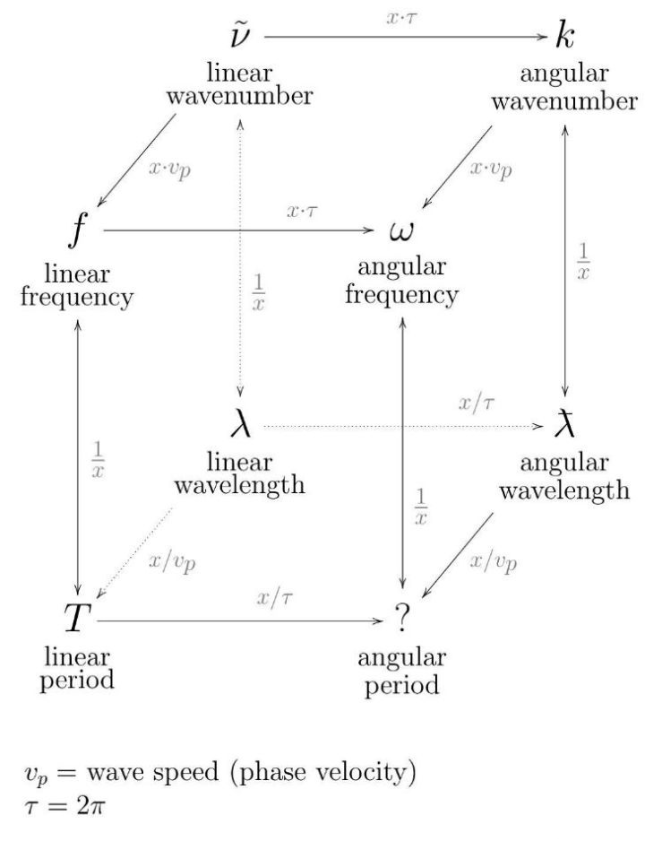

[toc]

## —— 量子力学的历史渊源及经典到量子的过渡

现代物理的两大基石：

- 相对论
- 量子力学

微观世界无法用经典力学描写， 量子力学便是对物质世界的新认识 ，物质属性及其微观结构这个古老而根本的问题，只有在量子力学的基础上,才能在原则上得以阐明。她有着“全新”的概念和理论形式。她复杂、精深，其正确性只能由其导出的结论被实验验证来理解（例如波函数没有经典物理量与之对应）。

认识量子力学先从以下两方面进入~

### 1. 光的波粒二象性

#### 黑体辐射公式

**黑体** 一个能全部吸收投射在它上面的辐射而无反射的物体（其本身会辐射）。

**黑体辐射的平衡状态：**内部发射的能量等于吸收的能量，即等效于无能量的散发。

能量密度: 单位体积单位频率间隔的能量。

推导： 体积为V的立方体空腔（宏观尺度），单位频率间隔的驻波数为$\displaystyle \frac{\boldsymbol{8} \pi v^{2}}{c^{3}} V$，乘以每个驻波的平均能量即得到黑体辐射公式

- $kT$     经典理论 **瑞利—金斯公式**  能量可能的取值连续    $\displaystyle \overline{\varepsilon_{v}}=\frac{\int_{0}^{\infty} \varepsilon e^{-\varepsilon \beta} d \varepsilon}{\int_{0}^{\infty} e^{-\varepsilon \beta} d \varepsilon}=k T \quad(\beta=1 / k T)$
- $\displaystyle  \frac{h v}{e^{h v / k T}-1}$   量子理论  **普朗克公式**  能量量子化  
$\displaystyle  \varepsilon=n(hv) (n=0,\  1,\ 2,\ \dots)$，代入得  $\displaystyle \overline{\varepsilon_{v}}=\frac{\sum_{n=0}^{\infty} n hv e^{-n h v \beta}}{\sum_{n=0}^{\infty} e^{-n h v \beta}}=\frac{h{\nu}}{e^{h v \beta}-1}$

黑体辐射的问题是普朗克引进**量子概念**后才得以解决。

#### 光电效应

当光照射到金属上时, 有光电子从金属中逸出。只有当光的频率大于一定值时, 才有光电子发射出来且无时间延迟，光电子的能量只与光的频率有关，而与光的强度无关。光的强度只影响光电子的数目。无时间延迟，**波动说不能解释光电效应**。爱因斯坦用**光量子**概念成功解释了光电效应。

$K_e =h{\nu} - W_0 \ \ ,K_e\text{光电子动能}$

#### Compton效应

X射线入射到石蜡中，可以近似为：

- 在碰前电子速度很小，近似静止。
- 电子在原子中的舒服能相对于X射线中的光子能量很小，视为自由电子。

在这个过程中：

- 能量守恒

  $h\nu+mc^2=h\nu'+E_e$

- 动量守恒

  $\textbf{p}-\textbf{p}'=\textbf{p}_e$

可以推出康普顿公式：$\displaystyle \Delta \lambda=\lambda^{\prime}-\lambda=\frac{4 \pi \hbar}{m_{b} c} \sin ^{2} \frac{\theta}{2}$

康普顿效应的发现，从实验上证实了光具有粒子性。实验证明：高频率的X射线被轻元素中的电子散射后，波长随散射角的增加而增大。按照经典电动力学，电磁波被散射后波长不应改变，如果把这个过程看作是光子与电子碰撞的过程，则康普顿效应就可以得到完美的解释。

#### ....

经过反复探索，得出光具有**波粒二象性**：
$$
E=h{\nu} \ \ \ \ p=\frac{h}{\lambda}
$$

- 光的粒子性和波动性方面是不可分割的，光同时表现为**波和粒子流**，波可以用来计算粒子出现的概率。
- 对光子行为的预言只能是**概率性的**

- 波 $E(\textbf r,t) $ 提供一个光子在 $t$ 时刻的信息，它是麦克斯韦方程组的解；我们说这个波表征光子在 $ t$ 时刻的状态。我们将 $ E(\textbf r,t) $ 解释为一个光子在 $t $ 时刻出现于 $ \textbf r$ 点的概率幅，这意味着相应的概率正比于 $|E(\textbf r,t)|^2  $ 。

### 2. Bohr的原子结构模型

经典理论在解释原子结构上的困难：

（1）经典理论不能建立一个稳定的原子模型（运动的带电粒子发射电磁场）；

（2）经典理论得出的频率是连续分布的，而实验中的原子光谱是分立的。

**玻尔假设**：

- 定态假设 

  电子在原子中不可能沿看经典理论所允许的每一个轨道运动，而只能沿看其中一组特殊的轨道运动

- 跃迁假设

  只有当电子由一个定态跃迁到另一个定态时，才产生辐射的吸收或发射现象。电子由能量为$E_m$的定态跃迁到能量为 $E_n$的定态时所吸收或发射的辐射频率$ {\nu} $满足$$\displaystyle \nu=\frac{\left|E_{n}-E_{n}\right|}{h}$$

- 量子化条件

  稳定状态下电子绕核运动的轨道角动量的值，必须为$\hbar$的整数倍，即$L=m v r=n \frac{h}{2 \pi}=n \hbar(n=1,2,3, \ldots)$

  

假设还是匀速圆周运动：

​         $$F=ma\Rightarrow \frac{e^2}{4\pi\varepsilon_0r^2}=\frac{mv^2}{r}\Rightarrow\frac{e^2}{4\pi\varepsilon_0r^2}=\frac{m}{r}n^2\frac{\hbar^2}{m^2r^2}\\ \Rightarrow r_n=n^2\frac{4\pi\varepsilon_0\hbar^2}{me^2}=n^2a_0\quad \left( a_0=\frac{4\pi\varepsilon_0\hbar^2}{me^2} \right)$$

转动角动量量子化同时意味着：电子轨道半径的量子化和能量的量子化：

​       $$E_{total}=\frac{1}{2}mv^2-\frac{e^2}{4\pi\varepsilon_0r}\\ \frac{e^2}{4\pi\varepsilon_0r^2}=\frac{mv^2}{r}\Rightarrow\frac{1}{2}mv^2=\frac{1}{2}\frac{e^2}{4\pi\varepsilon_0r}\Rightarrow E_{total}=-\frac{1}{2}\frac{e^2}{4\pi\varepsilon_0r}\\ E_n=-\frac{e^2}{8\pi\varepsilon_0\left( n^2a_0 \right)}=-\frac{E_0}{n^2}\quad \left( E_0=\frac{me^2}{8\varepsilon_0^2h^2} \right)$$

玻尔理论缺陷：

（1）当理论应用到结构稍复杂于氢原子的其他原子比如氦原子时，结果与实验不符；

（2）只能求出谱线的频率，而不能求出谱线的强度。

> 我看到玻尔理论觉得它是很僵硬的很不自然的，这些假设没有做出任何的解释~

### 3. **从经典到量子的过渡——量子条件**

> 有一些奇怪的东西，看来要学习一下理论力学了~

---

**一些奇怪的东西**

哈密顿量是与牛顿力学等价的另一种描述经典力学的理论，也就是哈密顿力学，其中的重要量。

哈密顿力学是经典力学的表现形式之一，用广义坐标和广义动量描述运动，用**正则方程**描述坐标和动量的演化，用哈密顿量来写正则方程。所以，构建一个物理系统，就是构建它的**哈密顿量**。作为比较，对于牛顿力学就是构建力的表达式，拉格朗日力学就是构建拉氏量。

能完整且不重复地描述系统状态的一组参数叫做**广义坐标**，而**广义动量**是正则共轭于广义坐标的物理量，又称为共轭动量。

引入广义坐标 **$(q_1,q_2,q_3,...)$** 和广义动量   $(p_1,p_2,p_3,...)$ ，后定义哈密顿量 $H(q_1,q_2,q_3,...,p_1,p_2,p_3,...)$ ,然后可以用正则方程表示经典力学方程： $\displaystyle \dot{p}_{i}=-\frac{\partial {H}}{\partial {q}_{i}} ; \quad \dot{{q}}_{i}=\frac{\partial {H}}{\partial {p}_{i}}$

-----

量子化的方法就是在经典理论基础上，引入关于广义坐标和广义动量$q,p$的附加条件——**量子条件**，过渡到量子理论，有

- #### **海森堡理论** $[q_i,p_i]=i\hbar$   矩阵力学
- #### **薛定谔理论** $\displaystyle p_{{i}}={i} \hbar \frac{\partial}{\partial {q}_{{i}}}$  波动力学

这两种理论是等价的，主要学习薛定谔理论： **建立基本方程→求波函数→求能量、角动量等物理量**

此外还有：

- #### **Sommerfeld** 量子化方法        “老量子论” （“半经典近似”）

    

    玻尔角动量量子化条件仅适用于圆形轨道，索末菲尔把玻尔量子化条件推广为：

    对于周期运动的多自由度体系，每个自由度 $i$ 都有

    $\displaystyle \oint p_{i} \cdot d q_{i}=\left(n_{i}+\gamma_{i}\right) h$  ，其中 $p\  q$ 分别为广义坐标和对应的动量 ，对于给定系统 $\gamma$ 是常数，$n\ \gamma$ 是量子数，回路积分是沿运动轨道积一圈。

    
    
    

### S补充

####  s1相空间

对于自由度为 $ s$ 的力学体系， $s $ 个广义坐标维度和 $ s$ 个广义动量维度张开的空间为 **相空间** ，其截面(也就是取几个坐标或者其线性组合)叫做**庞加莱截面**。

相空间在理论力学中是一个很基本的物理事实，能够给出很清晰的物理图像~

#### s2电磁场的广义动量 $p$

### 4. de Broglie 物质波假说

假说假定与一定能量 $E$和动量 $p$ 的实物粒子相联系的 波(称之为“物质波”)的**频率和波长**分别为$\displaystyle E=h{\nu} \ \ \ \ p=\frac{h}{\lambda}$ 换写一下： $\begin{array}{l}\omega=E / \hbar \\\vec{k}=\vec{p} / \hbar\end{array}$**圆频率和波矢量**  这称之为**de Broglie关系**，表明<u>是由粒子性决定波动性</u> 。

de Broglie关系适用于自由粒子和平面波之间的关系，平面波是：$$ \Psi(\vec{r}, t)=A \mathrm{e}^{i(\vec{k} \cdot \vec{r}-\omega t)}$$ 代入关系式得到 **de Broglie波**:
$$
\Psi(\vec{r}, t)=A \mathrm{e}^{i(\vec{p} \cdot \vec{r}-E t) / \hbar}
$$

各种不同形式的以及使用不同粒子(电子、原子、分子、原子核、核子等)的粒子波动性实验都证实了de Broglie假说。

几点理解：

- 波粒二象性是一切物质客体所普遍具有的属性。所有类型的粒子都与波相联系,而所有波都与波动相联系。因此，所有粒子(束)都有干涉，所有波动的能量都有量子特征。

- 在宏观区域内未发现这种联系，是因为与通常的波相联系的能量极小，而与通常物体相联系的γ很大，波长λ极小，不易观察。
- 经典理论没有考虑粒子的波动性，因而就不能解释微观粒子的运动。
- 实物粒子波与光波的**色散关系**不同。